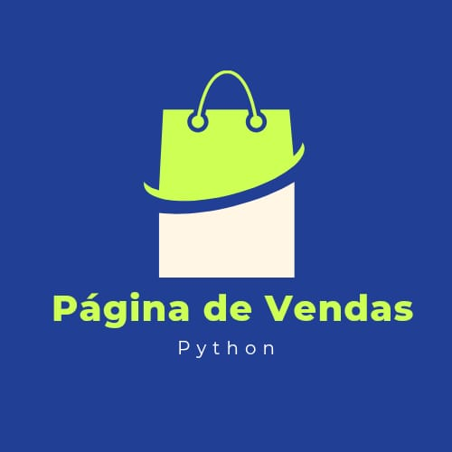

<h1 align="center">Sistema de Página de Venda (PDV)</h1>

  

  <em>Este é um sistema de gerenciamento de vendas, desenvolvido em Python, que utiliza conceitos da Introdução à Programação e manipulação de arquivos para garantir a persistência de dados e rastreabilidade de operações.</em>

---

### 🎯 | Objetivo
O objetivo principal deste sistema é fornecer uma solução integrada de Ponto de Venda (PDV) que automatiza o ciclo completo de comércio, desde a gestão de inventário.

---

### 👥 | Desenvolvimento
Esse sistema foi desenvolvido em colaboração mútua (em grupo), simulando um ambiente de desenvolvimento real onde a divisão de tarefas.

---

### 💻 | Principais Funcionalidades do Sistema
  - **Automação Comercial:** Facilitar o controle de estoque e o fluxo de caixa, permitindo o cadastro, atualização e remoção de produtos, vendedores e clientes de forma dinâmica.
  - **Persistência e Integridade de Dados:** Garantir que as informações não sejam perdidas após o encerramento do programa, utilizando arquivos de texto (.txt) para armazenar o banco de produtos.
  - **Auditoria e Rastreabilidade (Logs):** Monitorar cada operação crítica do sistema, gerando registros automáticos (Logs) com data e hora para documentar alterações em estoque e finalizações de compras.

---

### ⚙️ | Tecnologias Utilizadas
  - **Linguagem:** 
  - **Programa usado no Desenvolvimento:** Visual Studio Code
